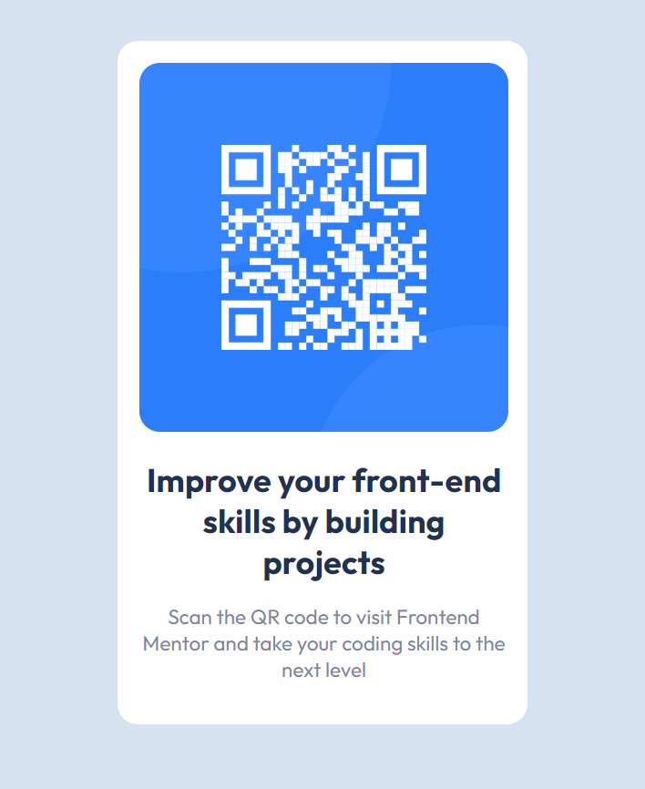

# Frontend Mentor - QR code component solution

This is a solution to the [QR code component challenge on Frontend Mentor](https://www.frontendmentor.io/challenges/qr-code-component-iux_sIO_H). Frontend Mentor challenges help you improve your coding skills by building realistic projects.

## Table of contents

- [Overview](#overview)
  - [Screenshot](#screenshot)
  - [Links](#links)
- [My process](#my-process)
  - [Built with](#built-with)
  - [What I learned](#what-i-learned)
  - [Continued development](#continued-development)
  - [Useful resources](#useful-resources)
- [Author](#author)
- [Acknowledgments](#acknowledgments)

## Overview

### Screenshot

### Links

- Live Site URL: [QR Code Component](https://sanchesaline6.github.io/qrcode-component-mentor/)

## My process

### Built with

- Semantic HTML5 markup
- CSS custom properties

## Author

- Linkedin - [@Aline Sanches](https://www.linkedin.com/in/aline-valente-sanches/)
- Frontend Mentor - [@sanchesaline6](https://www.frontendmentor.io/profile/sanchesaline6)
- GitHub - [@sanchesaline6](https://github.com/sanchesaline6)
